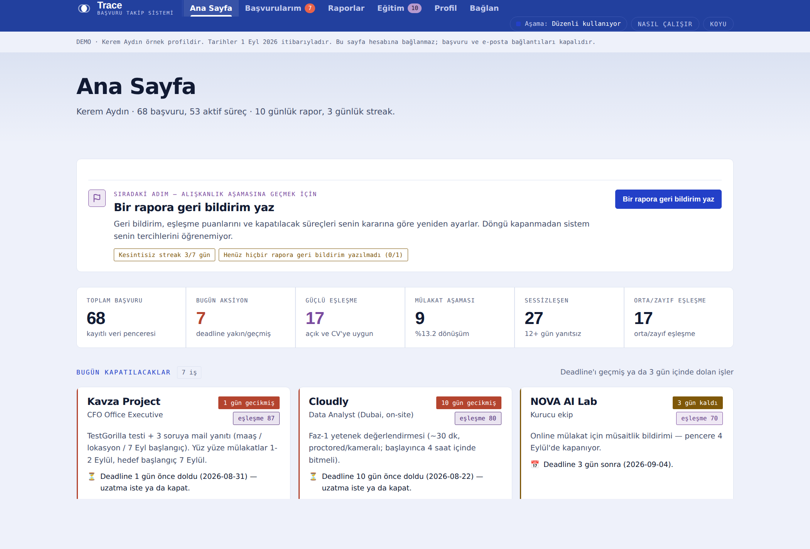

<div align="center">

# Trace

**İş başvurularını önceliklendiren, kayıtlı ilan/CV değerlendirmelerini puanlayan
ve eksik yetkinlikleri raporlayan AI destekli geliştirme projesi.**

Gerçek bir iş arama ihtiyacından doğdu. Açık depoda 68 kayıtlı demo veri bulunur;
Kerem Aydın örnek profildir, proje sahibi değildir.

[**Tanıtım →**](https://atalay9807.github.io/trace-job-tracker/trace.html) ·
[**Web demosu →**](https://atalay9807.github.io/trace-job-tracker/app.html) ·
[Teknik doküman](docs/TEKNIK.md) · [Ortak geliştirme](docs/ORTAK_CALISMA.md)

</div>

## Codex çalışma alanı

**[Güncel çalışma dalı](https://github.com/atalay9807/trace-job-tracker/tree/codex/calisma-alani)** ·
[Çalışma merkezi — Issue #4](https://github.com/atalay9807/trace-job-tracker/issues/4) ·
[Tamamlanan işler ve Claude'a devir](CODEX_CALISMA_ALANI.md)

GitHub ana sayfası varsayılan olarak `main` dalını gösterir. Geliştirmeleri görmek
için yukarıdaki çalışma dalını aç. GitHub Pages de `main` üzerinden yayınlanır;
geliştirme dalını açmak yayınlanan uygulamayı değiştirmez. Güncel PR ve kontrol
sonucu çalışma merkezinden izlenir. Bilgisayara kurulum gerekmez.

## Bugün ne çalışıyor?

| Özellik | Mevcut durum |
|---|---|
| Başvuru listesi, filtreler, sıralama, detaylar, iki tema | Demo verisiyle çalışan web arayüzü |
| Görünen başvuruları CSV indirme | Etkin filtreler ve ekran sırası korunur; dosya tarayıcıda oluşturulur |
| Aciliyet, eşleşme, hatırlatma ve raporlar | Python standart kütüphanesiyle çalışır; model çağrısı yapmaz |
| İlanı yorumlama ve eşleşme boyutlarını çıkarma | Claude Code ajan iş akışı; web demosunda otomatik çalışmaz |
| Gmail taraması | Ayrıca yetkilendirilmiş geliştirme oturumu/Routine gerekir; repo komutları Gmail taramaz |
| Kişisel CV analizi | Açık web demosunda kapalı; `sample` desteği sunan Claude ortamında açık onayla kullanılabilir |
| Gmail'i webden bağlama, kullanıcı hesabı, veri kaydetme | Henüz uygulanmadı |
| Eğitim kaynakları | Açıkça etiketli simülasyon; gerçek kurs/fiyat verisi değil |

Web demosu kişisel hesaba bağlanmaz. Başvuru/e-posta aksiyon bağlantıları
kamuya açık HTML'e dahil edilmez. Yayınlanan veri tarihi ekranda belirtilir.
CV analizi desteklenen ortamda sonucu yalnızca gösterir; profil kaydını veya
mevcut eşleşmeleri otomatik değiştirmez. PDF okuyucusu yalnızca destekli ortamda PDF seçildiğinde yüklenir; ilk 6 sayfa ve
en fazla 14.000 karakter analiz edilir.

Başvurularım ekranında açık/kapanan süreçler, aciliyet, eşleşme ve tarih birlikte
filtrelenebilir. Puanlanmamış kayıtlar ayrı seçilir; sıfır puanla karıştırılmaz.
Sıralama aciliyet, eşleşme, başvuru tarihi, deadline veya şirkete göre değişir.
**Görünenleri CSV indir** yalnızca listedeki sonuçları aktarır. CSV bir yedekleme
veya içeri aktarma biçimi değildir; kaynak JSON dosyalarını değiştirmez.

## Çözdüğü problem

Aynı anda çok sayıda başvuru yapıldığında üç karar zorlaşır:

| Soru | Trace'in yaklaşımı |
|---|---|
| Bugün ne yapmalıyım? | Deadline, süreç aşaması ve sessizliğe göre hatırlatma |
| Enerjimi nereye harcamalıyım? | Kayıtlı değerlendirmeden 0–100 eşleşme ve boyut dökümü |
| Neyi öğrenmeliyim? | İlan/profil farklarından çıkarılan eksikleri önceliklendirme |

Aciliyet ve eşleşme ayrı eksenlerdir. Bir işin acil olması adaya iyi uyduğu
anlamına gelmez; ekranda ayrı gösterilir.

## AI ile nasıl geliştiriliyor?

İlk sürüm Claude Code ile geliştirildi. Claude Code ve Codex aynı kod tabanı,
veri sözleşmesi ve testlerle çalışır. Dokuz Claude ajanı, ilan çözümleme,
eşleştirme, mülakat hazırlığı, veri denetimi ve strateji gibi görevleri ayırır.
Yedi skill görev kurallarını taşır. Ajan tanımı, her çalıştırmada ölçülmüş
başarı veya web uygulamasına bağlı bir AI servisi anlamına gelmez.

- **Ayrı kanıt:** İlan çözümleyici CV'yi okumaz; eşleştirici yapılandırılmış
  ilanı seçilmiş profille karşılaştırır.
- **Tek yazıcı:** Ajanlar öneri döndürür; kaydı ana oturum günceller.
- **Doğrulama:** Sayısal toplam/segment, şema ve sınır durumları kodla denetlenir.
- **İncelenebilir değişiklik:** Her görev ayrı dalda yürür; test çıktısı ve
  kalan sınırlamalarla teslim edilir.

[Claude talimatları](CLAUDE.md) · [Codex talimatları](AGENTS.md) ·
[Birlikte çalışma sözleşmesi](docs/ORTAK_CALISMA.md)

## Çalıştırma ve test

Python 3.11+ yeterlidir; çekirdeğin harici Python bağımlılığı yoktur.
Bunlar bulut geliştirme ortamında da çalıştırılabilir.

```bash
python3 src/veri.py                         # şema ve katalog denetimi
python3 src/pipeline.py --format markdown   # kayıtlı veriden günlük rapor
python3 src/pipeline.py --format csv        # tablo çıktısı
python3 src/match.py                        # eşleşme özeti
python3 src/insights.py                     # analizler
python3 src/build_dashboard.py              # kişisel pano → reports/pano.html
python3 src/build_dashboard.py --site       # yalnızca demo → site/app.html
python3 -m unittest discover -s tests -v
```

Arayüz davranış testleri Node 20+ ile, ağ erişimi olmadan jsdom'da çalışır:

```bash
npm ci --ignore-scripts
npm test
```

Bu bağımlılıklar yalnızca geliştirme testleri içindir. Gerçek model/Gmail
entegrasyonu ve görsel tarayıcı testleri bu kontrollerin kapsamı dışındadır.
GitHub Actions testleri çalıştırır; ana dalın Pages iş akışı testi geçtikten
sonra siteyi şablondan üretir. Ana dala birleştirme yayın başlatır.

## Veri ve ölçüm sınırları

**Demo / özel veri:** Gerçek veriler ayrı özel depoda tutulur. `TRACE_DATA`
seçilmiş veri klasörünü gösterir. Dış dosya eksikse demo veriye dönülmez.
Pano yedi JSON dosyasını da bekler; ayrıntı [teknik belgede](docs/TEKNIK.md).

**Red gerekçeleri bilinmiyor.** Demo değerlendirmelerinde 15 red kaydının
7'sine ekip yönetimi açığı işaretlenmiş. Bu, redlerin bu nedenle verildiğini
kanıtlamaz; 7/15 çoğunluk da değildir. Eksikler çıkarım olarak sunulur.

**İlk yanıt süresi ayrı bir ölçümdür.** `last_contact`, son teması gösterir;
şirketin ilk yanıtını göstermez. Süre yalnızca `first_response` kaydedilmişse
hesaplanır. Mevcut demo verisinde bu tarih yoktur; medyan gösterilmez.

**Aşamalar anlık durumdur.** Geçmişteki tüm mülakatları veya bir aşamadan
diğerine geçiş oranını göstermek için olay geçmişi gerekir. Bugünkü rapor
anlık aşamaları gösterir; ardışık dönüşüm uydurmaz.

**Görüntülenen ilan verisi yok.** Kaydedilen ilanlar yalnızca eldeki kayıtları
kapsar; bu sayıdan başvuruya dönüşüm oranı hesaplanmaz.

**Eşleşmeler değerlendirmeye dayanır.** `match.py` CV metnini kendisi analiz
etmez; önceden atanmış boyutları doğrulayıp toplar. Kaynak ilan metni olmayan
geçmiş puanlar doğrulanmış model başarısı sayılmaz. Puanlanmayan kayıt `null` kalır.

**Kurslar simülasyondur.** Başlık, süre, puan ve fiyatlar örnektir. Adayın
başarısı veya bir eğitimin iş bulma etkisi hakkında garanti verilmez.

## Dosya düzeni

| Yol | Sorumluluk |
|---|---|
| `data/` | Yedi JSON dosyası: başvuru, profil, beceri kataloğu, yaşam döngüsü, kullanım, kaydedilen ilan, rol hedefi |
| `src/veri.py` | Veri kaynağı, şema denetimi, ortak tarih/durum tanımları |
| `src/pipeline.py` | Aciliyet, hatırlatma, Markdown/text/CSV/JSON raporu |
| `src/match.py` | Boyutları toplama ve eşleşme segmentleri |
| `src/eslesme_kontrol.py` | Ajan önerisini dosyaya yazmadan denetleme |
| `src/insights.py` | Analizler ve eğitim planı |
| `src/build_dashboard.py` | Güvenli veri gömme ve demo üretimi |
| `src/dashboard.template.html` | Altı sayfalı arayüzün kaynağı |
| `tests/` | Python regresyonları ve DOM davranış testleri |
| `CODEX_CALISMA_ALANI.md` | Codex geliştirme kaydı, kontrol sonuçları ve Claude'a devir |
| `.claude/` | Claude ajanları ve görev skill'leri |
| `site/` | Tanıtım ve türetilmiş demo |

## Arayüz görselleri

Aşağıdaki görsel ilk prototipin arşividir; güncel özellik desteği yukarıdaki
tabloda ve ilgili dalın üretilmiş demosunda açıklanır. Görseller son düzeltme
paketinde yeniden çekilmedi.



## Canlı ürüne giden yol

Bu sürüm çok kullanıcılı bir servis değildir. Kullanıcı hesabı/veri izolasyonu,
kalıcı kayıt ve eşzamanlılık, sunucu tarafı Google yetkilendirmesi, görev kuyruğu,
gerçek model entegrasyonu ve ölçülmüş maliyetler canlı sürüm için açık işlerdir.
[Canlıya geçiş planı](docs/CANLIYA_GECIS.md) bunları kabul koşullarıyla ayırır.

**Proje sahibi: Atalay Denizer** · [GitHub](https://github.com/atalay9807)
