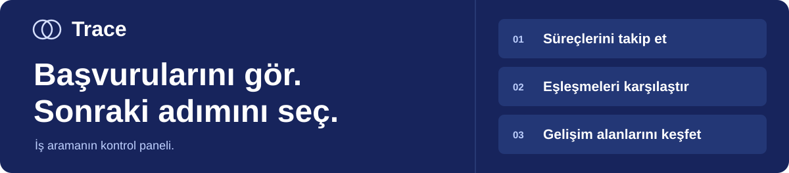
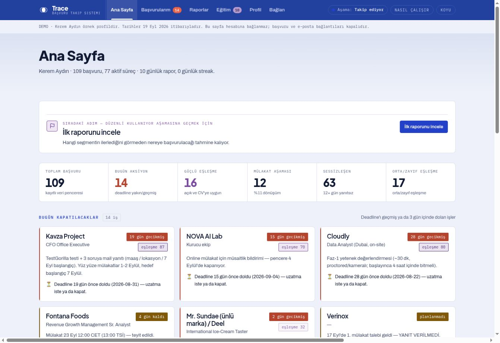
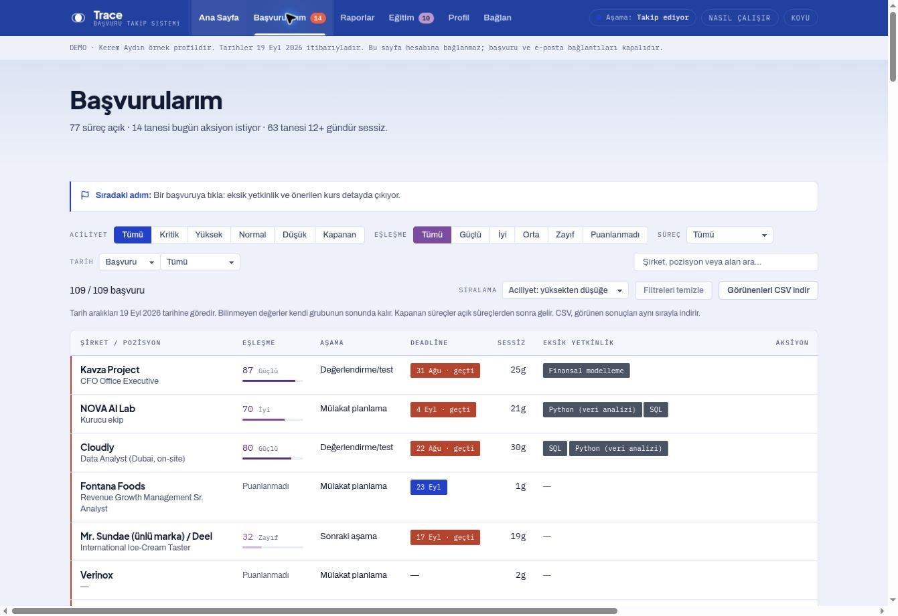
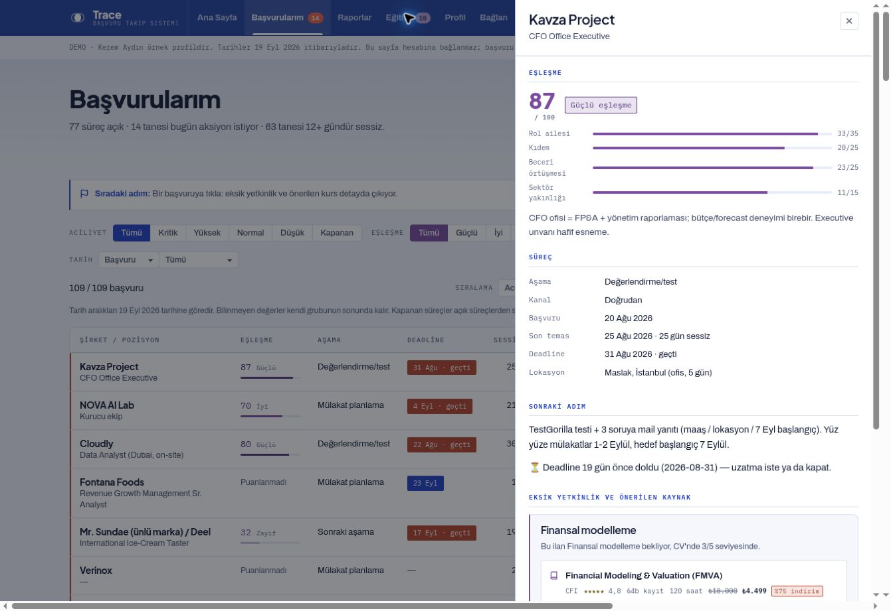
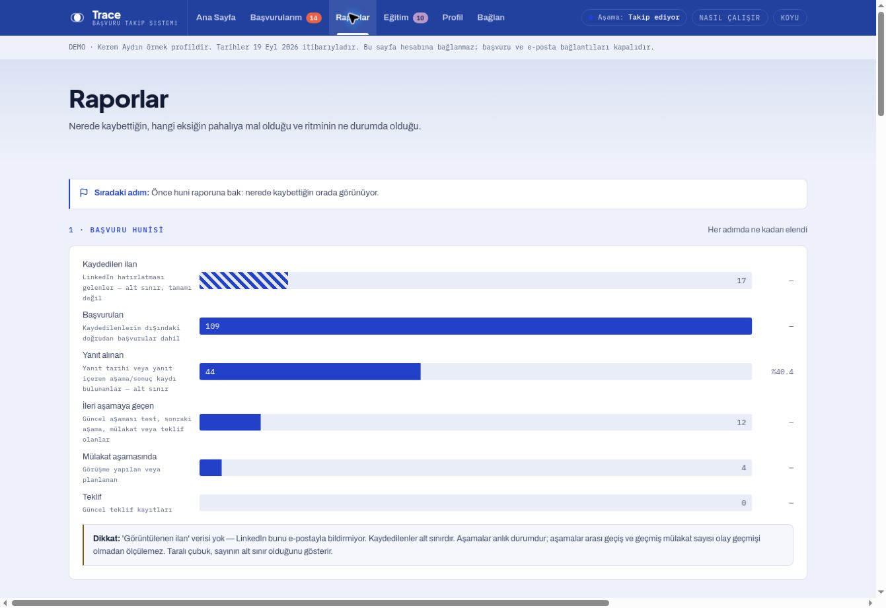
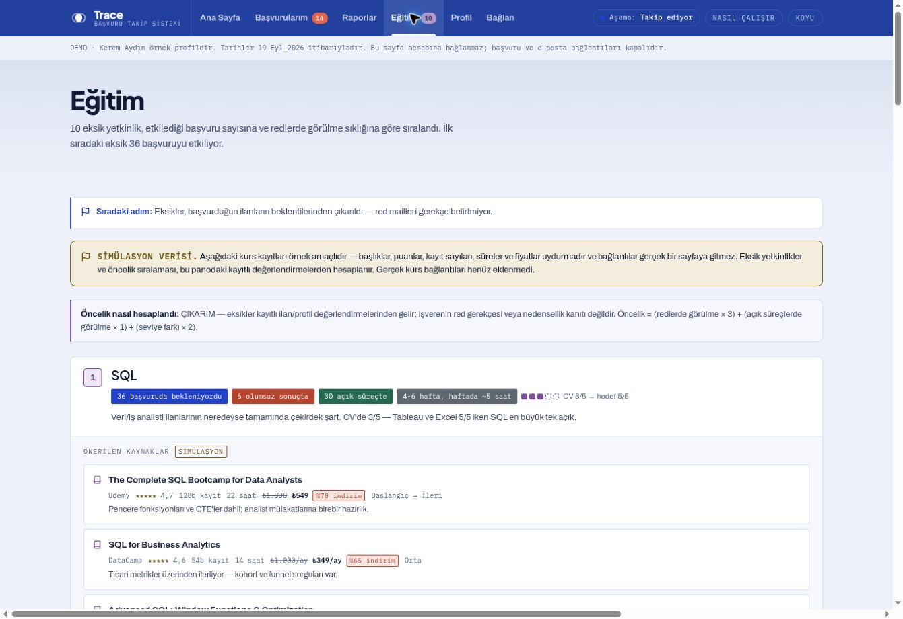

<div align="center">

# Trace

**Track your job applications, see your priorities, find the skills you are missing.**

<p>
<a href="https://atalay9807.github.io/trace-job-tracker/app.html"></a>
&nbsp;
<a href="https://atalay9807.github.io/trace-job-tracker/trace.html"></a>
</p>

A web demo that needs no installation · Explore it with sample data

<a href="https://atalay9807.github.io/trace-job-tracker/app.html"></a>

[Explore the screens](#explore-the-screens) · [Built with AI](#built-with-ai) · [Technical details](#technical-details)

[](https://github.com/atalay9807/trace-job-tracker/actions/workflows/kontrol.yml)
[](LICENSE)

</div>

> **The interface speaks Turkish.** An English option is planned and will work
> like the light/dark theme switch — see [the roadmap](ROADMAP.md#bilingual-interface).
> The screenshots below are of the Turkish interface.

## Trace at a glance

See scattered applications in one place. Spot what is coming up, compare stored
posting and CV assessments, and look at which skills to focus on. **Urgency and
match are shown separately:** an urgent job may not be your best match.

<a href="https://atalay9807.github.io/trace-job-tracker/app.html#/ana"></a>

> **This is a demo.** It uses a sample profile and anonymized records, and
> connects to no personal account. Matches are computed from stored
> assessments, and the courses are simulated. The images were captured from the
> published demo on 20 September 2026.

<a id="explore-the-screens"></a>

## Explore the screens

Click an image to open that screen of the app.

<table>
<tr>
<td width="50%" valign="top">
<h3>01 · Manage your applications</h3>
<p>Filter open and closed processes. Sort by urgency, match or date, and download the visible results as CSV.</p>
<a href="https://atalay9807.github.io/trace-job-tracker/app.html#/basvurular"></a>
<p><a href="https://atalay9807.github.io/trace-job-tracker/app.html#/basvurular"><strong>Look at the applications →</strong></a></p>
</td>
<td width="50%" valign="top">
<h3>02 · See why something matches</h3>
<p>Inspect the role, seniority, skill and sector dimensions separately. See the rationale behind the total score and the next step.</p>
<a href="https://atalay9807.github.io/trace-job-tracker/app.html#/basvurular/kavza-project-cfo-office-executive"></a>
<p><a href="https://atalay9807.github.io/trace-job-tracker/app.html#/basvurular/kavza-project-cfo-office-executive"><strong>Open the sample match →</strong></a></p>
</td>
</tr>
<tr>
<td width="50%" valign="top">
<h3>03 · Read the bigger picture</h3>
<p>Look at application stages, replies and missing skills. Values that cannot be measured are marked with explicit labels.</p>
<a href="https://atalay9807.github.io/trace-job-tracker/app.html#/raporlar"></a>
<p><a href="https://atalay9807.github.io/trace-job-tracker/app.html#/raporlar"><strong>Explore the reports →</strong></a></p>
</td>
<td width="50%" valign="top">
<h3>04 · Plan what to learn</h3>
<p>See the gaps from the posting and profile assessments in priority order. Explore the learning plan flow with sample resources.</p>
<a href="https://atalay9807.github.io/trace-job-tracker/app.html#/egitim"></a>
<p><a href="https://atalay9807.github.io/trace-job-tracker/app.html#/egitim"><strong>See the training plan →</strong></a></p>
</td>
</tr>
</table>

**[Try the app →](https://atalay9807.github.io/trace-job-tracker/app.html)** · **[Read the product story →](https://atalay9807.github.io/trace-job-tracker/trace.html)**

<a id="built-with-ai"></a>

## Built with AI

Trace is an **AI-assisted development portfolio** that grew out of a real job
search. **Atalay Denizer** sets the product direction and the priorities. The
first version was built with Claude Code; Claude takes technical lead,
implementation and integration, while Codex contributes independent review,
testing and complementary development. Every change is reviewable through the
GitHub history and the pull requests.

The repository holds **9 agent roles and 7 skills**. The posting analyzer and
the matcher have separate jobs; the two role advisors, one looking at the
profile and one at past outcomes, also draw on separate evidence. Agents
produce suggestions, a single designated writer stores the record, and the
schema and the arithmetic are validated by code.

These role definitions do not mean an AI service is wired into the web demo,
nor that model success has been measured. How the work is done, and the
contributions:

[Claude instructions](CLAUDE.md) · [Codex instructions](AGENTS.md) · [Collaboration](docs/collaboration.md) · [Contributing](CONTRIBUTING.md) · [Codex work hub](https://github.com/atalay9807/trace-job-tracker/issues/4)

<a id="technical-details"></a>

## Technical details

The working demo, the architecture and the development notes are below. Open
whichever section you need.

<details>
<summary><strong>Current features and the planned web application</strong></summary>

| Capability | State today |
|---|---|
| Application list, filters, sorting, detail panel, two themes | A web interface running on demo data |
| CSV download of the visible applications | The active filter and on-screen order are preserved; the file is built in the browser |
| Urgency, match, reminders and eight analysis reports | Computed with the Python standard library; makes no model call |
| Interpreting a posting and deriving match dimensions | A Claude Code agent workflow; does not run automatically in the web demo |
| Gmail scanning | Requires a separately authorized session or automation |
| CV analysis | In a development environment with the right tool support; disabled in the public web demo |
| User accounts, saved data, connecting Gmail from the web | Not implemented |
| Training resources | Explicitly labelled simulation |

**The account-based web application is separate work:** [`web-live/`](web-live/)
holds the Phase 1 scope and its development rules. The planned first release
covers login, CV upload, the onboarding flow and the application board. The
simplified application pipeline is defined as
`saved → applied → interview → offer / rejected`. Do not confuse that plan with
the current features of the static demo above.

[Phase 1 scope](web-live/docs/faz-1-spec.md) · [Web application rules](web-live/CLAUDE.md)

</details>

<details>
<summary><strong>Architecture, file map and design system</strong></summary>

Authorized data collection and agent assessments feed the JSON records. The
Python core validates those records and computes urgency, match and the
reports. The builder embeds the demo data into the HTML template to produce the
web interface.

| Path | Responsibility |
|---|---|
| `data/` | Demo applications, profile and supporting catalogs across seven JSON files |
| `src/veri.py` | Data source selection, schema validation, shared date and status definitions |
| `src/pipeline.py` | Urgency, reminders, Markdown/text/CSV/JSON reports |
| `src/match.py` | Summing match dimensions and assigning segments |
| `src/eslesme_kontrol.py` | Schema and arithmetic check on an agent suggestion before it is stored |
| `src/insights.py` | Eight analyses and the training plan |
| `src/anonimlestir.py` | Deriving the demo data from real data |
| `src/dashboard.template.html` | Source of the six-page interface |
| `src/build_dashboard.py` | Data embedding and demo build |
| `tests/` | Python regressions and DOM behaviour tests |
| `.claude/` | Agent role definitions and task rules |
| `site/` | Overview page and the generated demo |
| `web-live/` | Phase 1 plan of the separate web application |

`site/app.html`, `site/_artifact.html` and `reports/pano.html` are generated
outputs. An interface change is made in the template and rebuilt.

In the design, **indigo** carries the brand, **the purple tones** carry match
quality, and **red / amber / green** carry process status. Theme and contrast
details are in the [technical contract](docs/technical-contract.md).

</details>

<details>
<summary><strong>Running and testing, for developers</strong></summary>

Trying the web demo needs no installation. To work on the code, Python 3.11+ is
enough; the computation core has no external Python dependency.

```bash
git clone https://github.com/atalay9807/trace-job-tracker.git
cd trace-job-tracker

python3 src/veri.py
python3 src/pipeline.py --format markdown
python3 src/match.py
python3 src/insights.py
python3 src/build_dashboard.py --site
python3 -m unittest discover -s tests -v
```

The interface development tests use Node 20+ and jsdom:

```bash
npm ci --ignore-scripts
npm test
git diff --check
```

These checks can run in the cloud or on
[GitHub Actions](https://github.com/atalay9807/trace-job-tracker/actions). The
DOM tests do not verify real Gmail or model access, nor the visual layout in a
browser.

</details>

<details>
<summary><strong>Demo data, privacy and measurement limits</strong></summary>

- **Sample identity:** Kerem Aydın is a demo profile; the project owner is
  Atalay Denizer.
- **Private data:** real records are kept outside the public repository and
  selected with `TRACE_DATA`. If the selected external data is missing, the
  code does not silently fall back to demo data. The data directory must be the
  same for every script and for the relevant agents.
- **Publishing limit:** static HTML carries the data inside it and
  authenticates nobody. A dashboard containing private data is never uploaded
  to a public server; `--site` accepts only the repository's demo data.
  Personal application and email actions are not added to the public HTML.
- **CSV:** an export of the visible results. It is not a backup or import
  format and does not modify the source JSON.
- **Match:** `match.py` does not analyse the CV text; it sums the stored
  dimensions. An unknown score stays `null`. Historical scores with no source
  posting text do not count as verified model success.
- **Rejection reasons:** a gap inferred from the difference between a posting
  and the profile does not prove the company rejected the person for that
  reason.
- **Replies and stages:** the first reply is measured with `first_response`;
  `last_contact` cannot stand in for it. Without event history, current stages
  are never presented as a sequential conversion rate. The total number of
  postings ever shown to the user is unknown.
- **Training:** course titles, prices and the enrolment flow are examples. They
  do not mean a real course service is connected.

The data flow and validation rules are in the
[collaboration contract](docs/collaboration.md).

</details>

<details>
<summary><strong>Roadmap and development documents</strong></summary>

Moving to a multi-user product requires identity and data isolation, safe
record updates, server-side integrations and data management, all planned
separately. The acceptance conditions are in the
[production readiness plan](docs/production-readiness.md) and in
[`ROADMAP.md`](ROADMAP.md); the limits of the first web release are in the
[Phase 1 scope](web-live/docs/faz-1-spec.md).

| Document | What it is read for |
|---|---|
| [Technical contract](docs/technical-contract.md) | Computations, data model and interface decisions |
| [Roadmap](ROADMAP.md) | What blocks a launch, and in what order it matters |
| [Contributing](CONTRIBUTING.md) | Setup, verification commands and the rules a pull request must meet |
| [Security policy](SECURITY.md) | How to report a vulnerability privately |
| [Collaboration](docs/collaboration.md) | Claude/Codex task split and handover rules |
| [Codex handover log](CODEX_CALISMA_ALANI.md) | Previous reviews, contributions and verifications |
| [Automation notes](docs/automation.md) | How data is collected in an authorized session |
| [Showcase maintenance notes](docs/readme-showcase.md) | This page's images, sources and update rules |

</details>

---

<div align="center">

**Atalay Denizer** · AI-assisted development portfolio · [GitHub profile](https://github.com/atalay9807)

[Open the app](https://atalay9807.github.io/trace-job-tracker/app.html) · [Explore the site](https://atalay9807.github.io/trace-job-tracker/trace.html)

Licensed under the [MIT License](LICENSE) · [Code of Conduct](CODE_OF_CONDUCT.md)

</div>
