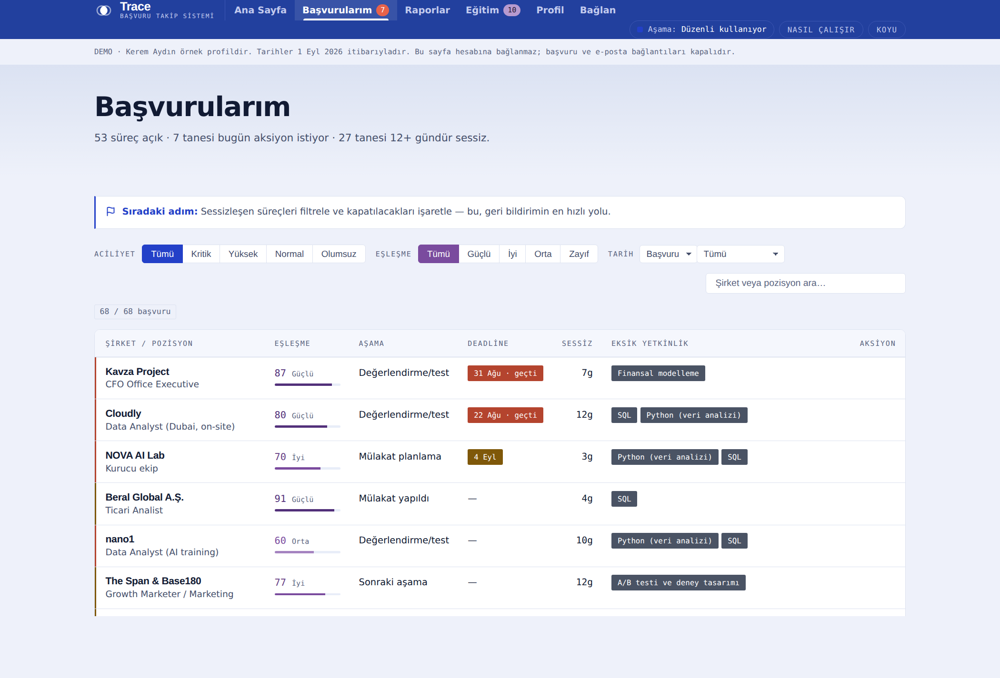
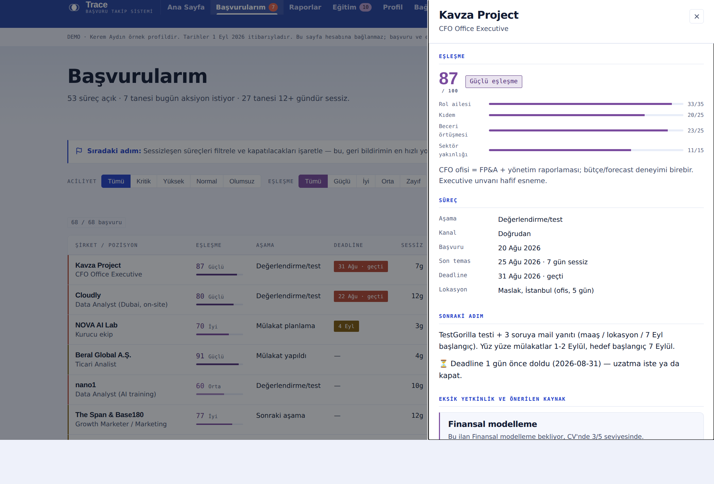
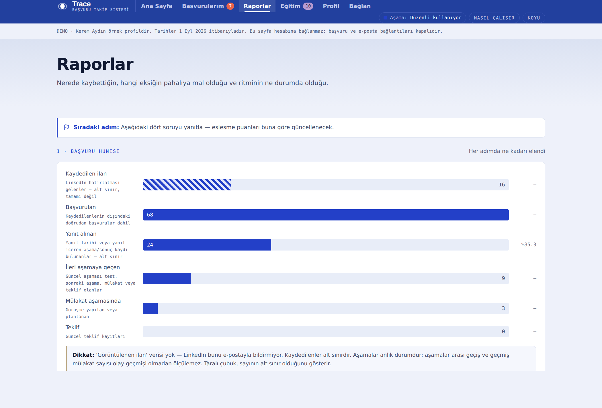
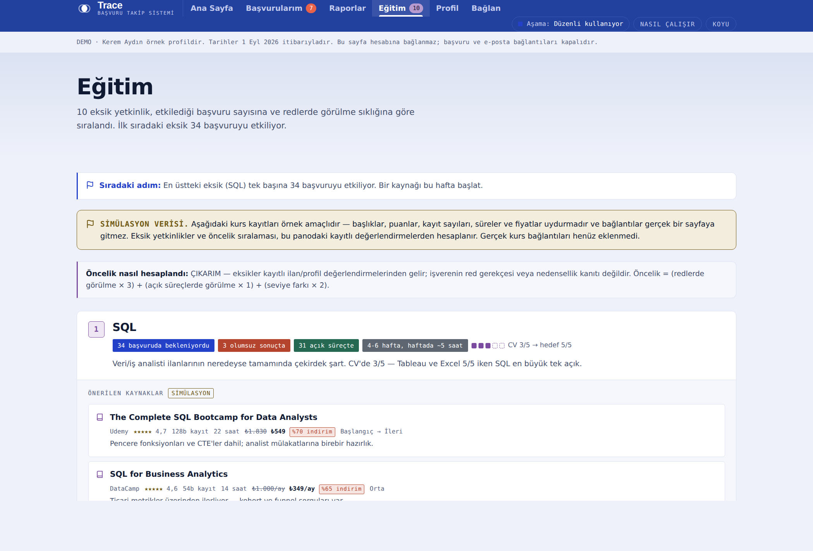
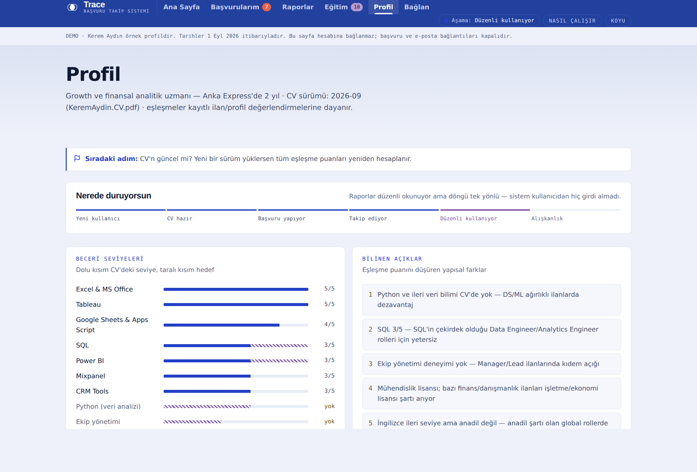
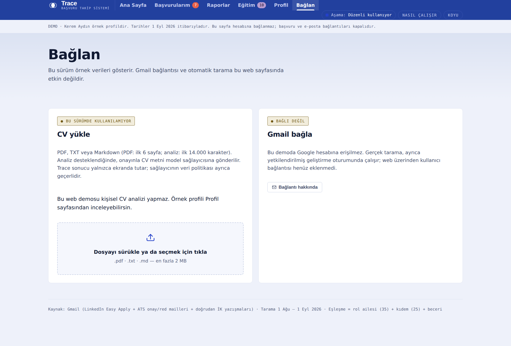

<div align="center">


# Trace

### İş başvurularını önceliklendiren, ilanları CV'ye göre puanlayan ve eksik yetkinlikleri çıkaran takip sistemi

**Üç soruyu yanıtlar:** Bugün ne yapmalıyım? · Enerjimi nereye harcamalıyım? · Neyi öğrenmeliyim?

<br>

### [🚀 Canlı Demo — Uygulamayı Aç](https://atalay9807.github.io/trace-job-tracker/app.html) &nbsp;·&nbsp; [📖 Tanıtım Sayfası](https://atalay9807.github.io/trace-job-tracker/trace.html)

<br>

`Python 3.11+` · `Sıfır harici bağımlılık` · `Tek dosya HTML arayüz` · `9 AI ajanı` · `7 skill`

[Teknik doküman](docs/TEKNIK.md) · [Canlıya geçiş planı](docs/CANLIYA_GECIS.md) · [Ortak geliştirme](docs/ORTAK_CALISMA.md)

</div>

---

## Ne yapar?

Aynı anda 60+ başvuru yapıldığında üç şey birden kaybolur: hangi sürecin nerede
olduğu, hangisine enerji harcamaya değdiği ve neden elendiğin. Trace bu üçünü
ayrı ayrı ölçer ve **ölçemediğini açıkça söyler.**

<table>
<tr>
<td width="50%" valign="top">

### 📋 Başvurular — iki eksen karışmaz

Her satırda **aciliyet** ve **eşleşme** ayrı kolonda durur. Zayıf eşleşmeli bir
ilanın deadline'ı da acil olabilir; karar kullanıcıya bırakılır.

Açık/kapanan süreç, aciliyet, eşleşme ve tarih birlikte filtrelenir. Puanlanmamış
kayıtlar ayrı seçilir — **sıfır puanla karıştırılmaz.** Sıralama aciliyet,
eşleşme, başvuru tarihi, deadline veya şirkete göre değişir.

</td>
<td width="50%" valign="top">



</td>
</tr>
<tr>
<td width="50%" valign="top">

### 🎯 Eşleşme — dört boyutlu döküm

Rol ailesi (35) + kıdem (25) + beceri örtüşmesi (25) + sektör (15) − lokasyon
cezası. Tek bir puan değil, **nereden geldiği görünen** bir puan.

🟢 Güçlü 78–100 · 🔵 İyi 62–77 · 🟡 Orta 45–61 · 🔴 Zayıf 0–44

</td>
<td width="50%" valign="top">



</td>
</tr>
<tr>
<td width="50%" valign="top">

### 📊 Raporlar — ölçülemeyen uydurulmaz

Huninin ilk adımı **taralı çubukla** gösterilir: "alt sınır, tamamı değil."
Ondan sonraki dönüşüm **hesaplanmaz**, çünkü LinkedIn görüntülenen ilan
verisini e-postayla bildirmiyor.

Bu, projenin en ayırt edici kararı — rakiplerin hiçbirinde yok.

</td>
<td width="50%" valign="top">



</td>
</tr>
<tr>
<td width="50%" valign="top">

### 🎓 Eğitim — eksikten kaynağa

İlan ile profil arasındaki fark `gap_skills`'e düşer, oradan öncelik sıralı
eğitim planına. Kurs kayıtları **simülasyondur** ve bu üç ayrı yerde etiketlenir.

</td>
<td width="50%" valign="top">



</td>
</tr>
</table>

---

## En kritik kural: ölçülemeyen şey uydurulmaz

Bu proje, ölçemediği şeyleri açıkça söylediği için güvenilir. Üç sınır arayüzün
her yerinde etiketlidir ve kaldırılmaz:

| Sınır | Neden bilinmiyor | Arayüzde nasıl görünür |
|---|---|---|
| **Red gerekçeleri** | Red e-postalarının hiçbiri sebep belirtmiyor | Eksik yetkinlikler **"ÇIKARIM"** diye etiketlenir |
| **Görüntülenen ilan sayısı** | LinkedIn e-postayla bildirmiyor | Huninin ilk adımı **taralı çubuk**; sonraki dönüşüm hesaplanmaz |
| **Kurs kayıtları** | Gerçek kurs API'si bağlı değil | **Üç yerde** simülasyon etiketi: sayfa bandı, liste, tıklama |

Buna bağlı iki kural: **URL uydurulmaz** (doğrulanmamışsa Gmail arama derin
bağlantısı üretilir) ve **üçüncü kişilerin adı depoya girmez** (İK çalışanları
`İK Müdürü — ik@x.example` gibi rol etiketiyle temsil edilir).

---

## Bugün ne çalışıyor?

| Özellik | Durum |
|---|---|
| Başvuru listesi, filtreler, sıralama, detay paneli, iki tema | ✅ Demo verisiyle çalışan web arayüzü |
| Görünen başvuruları CSV indirme | ✅ Etkin filtre ve ekran sırası korunur; dosya tarayıcıda oluşturulur |
| Aciliyet, eşleşme, hatırlatma, sekiz analiz raporu | ✅ Python standart kütüphanesi; model çağrısı yapmaz |
| İlan yorumlama ve eşleşme boyutu çıkarma | ⚙️ Claude Code ajan akışı; web demosunda otomatik çalışmaz |
| Gmail taraması | ⚙️ Ayrıca yetkilendirilmiş oturum/Routine gerekir |
| CV analizi | ⚙️ `sample` destekli ortamda; açık web demosunda kapalı |
| Kullanıcı hesabı, veri kaydetme, webden Gmail bağlama | ❌ Henüz uygulanmadı |
| Eğitim kaynakları | ⚠️ Açıkça etiketli simülasyon |

> Web demosu kişisel hesaba bağlanmaz. Başvuru/e-posta aksiyon bağlantıları
> kamuya açık HTML'e dahil edilmez. Yayınlanan veri tarihi ekranda belirtilir.
>
> **CSV bir yedekleme veya içeri aktarma biçimi değildir** — yalnızca ekranda
> görünen sonuçları aynı sırayla dışarı verir, kaynak JSON dosyalarını değiştirmez.

Codex tarafından incelenen ve geliştirilen sürümün notları
[`CODEX_CALISMA_ALANI.md`](CODEX_CALISMA_ALANI.md) içinde; güncel çalışma
[Issue #4](https://github.com/atalay9807/trace-job-tracker/issues/4) üzerinden izlenir.

---

## Hızlı başlangıç

Python 3.11+ yeterlidir; çekirdeğin **harici Python bağımlılığı yoktur.**

```bash
git clone https://github.com/atalay9807/trace-job-tracker.git
cd trace-job-tracker

python3 src/veri.py                         # şema ve katalog denetimi
python3 src/pipeline.py --format markdown   # kayıtlı veriden günlük rapor
python3 src/match.py                        # eşleşme özeti ve segmentler
python3 src/insights.py                     # sekiz rapor + eğitim planı
python3 src/build_dashboard.py --site       # demo arayüzü üret → site/app.html
```

Testler:

```bash
python3 -m unittest discover -s tests -v    # Python regresyonları
npm ci --ignore-scripts && npm test         # jsdom DOM testleri (Node 20+, ağsız)
```

Bu Node bağımlılıkları yalnızca geliştirme testleri içindir. Gerçek model/Gmail
entegrasyonu ve görsel tarayıcı testleri bu kontrollerin kapsamı dışındadır.

---

## Mimari

```
Gmail  ──▶  mail-siniflandirma  ──▶  data/*.json  ──▶  pipeline.py  ──▶  rapor
(yetkili                (skill)      (tek doğruluk      match.py        (md/csv/json)
 oturum)                              kaynağı)          insights.py
                                          │
              ilan-cozumleyici ──▶ eslestirici ──▶ match objesi
                  (ajan)              (ajan)            │
                                                        ▼
                                          build_dashboard.py ──▶ site/app.html
```

**Veri katmanı tek doğruluk kaynağıdır.** `data/` altındaki yedi JSON dosyasını
kod okur; koda asla sabit veri gömülmez.

| Yol | Sorumluluk |
|---|---|
| `data/` | Başvuru, profil, beceri kataloğu, yaşam döngüsü, kullanım, kaydedilen ilan, rol hedefi |
| `src/veri.py` | Veri kaynağı, şema denetimi, ortak tarih/durum tanımları |
| `src/pipeline.py` | Aciliyet hesabı, hatırlatma, Markdown/text/CSV/JSON raporu |
| `src/match.py` | Boyut toplama ve eşleşme segmentleri |
| `src/eslesme_kontrol.py` | Ajan önerisini dosyaya yazmadan denetleme |
| `src/insights.py` | Sekiz analiz ve eğitim planı |
| `src/build_dashboard.py` | Güvenli veri gömme ve demo üretimi |
| `src/dashboard.template.html` | Altı sayfalı arayüzün kaynağı |
| `tests/` | Python regresyonları ve DOM davranış testleri |
| `.claude/` | Dokuz ajan ve yedi skill |
| `site/` | Tanıtım sayfası ve türetilmiş demo |

`reports/pano.html` ve `site/_artifact.html` **türetilmiş dosyalardır** — elle
düzenlenmez, şablon değiştirilip yeniden üretilir.

---

## AI ile nasıl geliştirildi?

İlk sürüm Claude Code ile geliştirildi. Claude Code ve Codex aynı kod tabanı,
veri sözleşmesi ve testlerle çalışır.

**Dokuz ajan, tek iş ilkesi.** İlan çözümleyici ile eşleştirici bilerek
ayrıdır: bir ilanı hem yorumlayıp hem puanlayan tek ajan, ilanı kendi vereceği
puana göre okumaya başlıyor. Ayrık tutulunca çözümleyici tarafsız veri üretiyor.

**İki rol önerici çifttir.** Biri yalnızca CV'ye, öteki yalnızca başvuru
sonuçlarına bakar; kanıt tabanları kasıtlı olarak kesişmez. Anlaştıkları unvan
güçlü hedeftir, **ayrıştıkları yer asıl bilgidir** — ortalaması alınmaz.

- **Tek yazıcı:** Ajanlar öneri döndürür; kaydı ana oturum yazar.
- **Doğrulama:** Sayısal toplam, segment, şema ve sınır durumları kodla denetlenir.
- **İncelenebilir değişiklik:** Her görev ayrı dalda; test çıktısı ve kalan
  sınırlamalarla teslim edilir.

Ajan tanımı, her çalıştırmada ölçülmüş başarı veya web uygulamasına bağlı bir
AI servisi anlamına gelmez.

[Claude talimatları](CLAUDE.md) · [Codex talimatları](AGENTS.md) · [Birlikte çalışma sözleşmesi](docs/ORTAK_CALISMA.md)

---

## Tasarım sistemi

Üç renk üç ayrı iş yapar, birbirine karışmaz:

- **İndigo** — marka ve hacim
- **Mor rampa** (`--m1`…`--m4`, sıralı) — yalnızca eşleşme kalitesi
- **Kırmızı / kehribar / yeşil** — boru hattı durumu

Renk eklenirken **kontrast ölçülür, göz kararı yapılmaz:** metin 4.5:1, grafik
dolgusu 3:1 — her iki temada ayrı ayrı. Rampalar açıklık bakımından monotoniktir.
Palet değerleri [`docs/TEKNIK.md`](docs/TEKNIK.md) içinde.

<div align="center">


</div>

---

## Veri ve ölçüm sınırları

**Demo / özel veri ayrımı.** Açık depoda `data/` altında **anonim demo veri**
bulunur; Kerem Aydın örnek profildir, proje sahibi değildir. Gerçek veriler ayrı
bir özel depoda tutulur ve `TRACE_DATA` ortam değişkeniyle dışarıdan verilir:

```bash
TRACE_DATA=/yol/ozel-veri/data python3 src/pipeline.py
```

Dört script de bu değişkeni okur; verilmezse deponun kendi `data/` klasörünü
kullanır. Dış dosya eksikse demo veriye **dönülmez.**

**İlk yanıt süresi ayrı bir ölçümdür.** `last_contact` son teması gösterir,
şirketin ilk yanıtını değil. Süre yalnızca `first_response` kaydedilmişse
hesaplanır; mevcut demo verisinde bu tarih yoktur, medyan gösterilmez.

**Aşamalar anlık durumdur.** Geçmişteki tüm mülakatları veya aşamalar arası
geçiş oranını göstermek için olay geçmişi gerekir. Bugünkü rapor anlık aşamaları
gösterir; ardışık dönüşüm uydurmaz.

**Eşleşmeler değerlendirmeye dayanır.** `match.py` CV metnini kendisi analiz
etmez; önceden atanmış boyutları doğrulayıp toplar. Kaynak ilan metni olmayan
geçmiş puanlar doğrulanmış model başarısı sayılmaz.

---

## Canlı ürüne giden yol

Bu sürüm **çok kullanıcılı bir servis değildir.** Açık işler kabul koşullarıyla
[canlıya geçiş planında](docs/CANLIYA_GECIS.md) ayrılmıştır. Üçü zorunludur:

1. **Kimlik ve veri izolasyonu** — bugün tüm veri derleme anında HTML'e gömülüyor;
   statik dosyada kimlik doğrulama yok. "Verimi sil" dendiğinde silinecek bir yer
   de yok — ölçemediğini söyleyen bir ürün, silemediğini "sildim" diyemez.
2. **Sunucu tarafı Gmail erişimi** — `gmail.readonly` restricted scope; Google
   doğrulaması ve yıllık CASA denetimi gerektiriyor.
3. **Yazma yolu ve eşzamanlılık** — kayıt güncellemesi şu an bir git commit'i.
   Kırılma ölçekte değil **n=2'de** başlar.

Ayrıca canlıya çıkmadan gizlilik metni yazılmalı (KVKK'da VERBİS muafiyeti var
ama **aydınlatma yükümlülüğü muafiyete tabi değil**) ve üçüncü taraf istekleri
(Google Fonts, cdnjs) kaldırılmalıdır.

---

<div align="center">

**Proje sahibi: Atalay Denizer** · [GitHub](https://github.com/atalay9807)

Gerçek bir iş arama ihtiyacından doğdu. Hem sahibinin günlük kullandığı bir araç,
hem işverene gösterilen bir portföy projesi.

</div>
